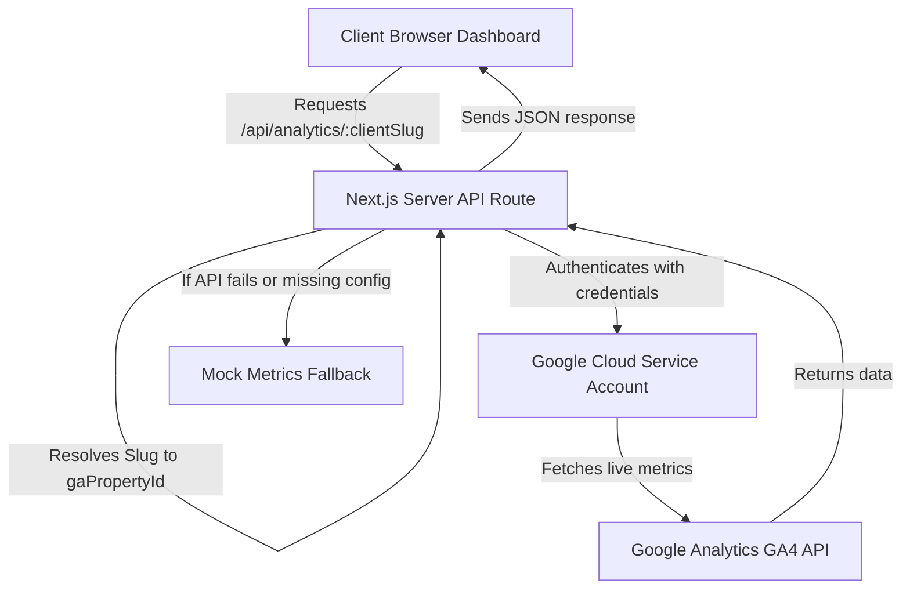

# Google Analytics Client Integration Plan

This plan details how to build a multi-tenant client analytics dashboard in the Egostix Media Portal. When clients log in, the dashboard dynamically queries the Google Analytics Data API (GA4) for their specific site property, pulling live traffic, click rates, and visitor locations, while providing clean simulated fallbacks for properties without active API connections.

---

## Architecture Overview



---

## Detailed Implementation Steps

### Step 1: Client Database Mapping
We will add a `gaPropertyId` field (and optionally `gaStreamId`) to the client records. This maps the logged-in client's dashboard view to their real Google Analytics property.

Example structure inside `DashboardContext.jsx`:
```javascript
{
  slug: "apex-realty-platform",
  name: "Apex Luxury Real Estate Group",
  logo: "/work/apex-realty/apex-realty.jpg",
  gaPropertyId: "412345678", // Real GA4 property ID (or null for simulated fallback)
  // ... other metrics
}
```

### Step 2: Set Up Server-Side Authentication
To query multiple client properties securely without exposing keys:
1. Create a single **Google Cloud Service Account** in the agency's Google Developer Console.
2. Store the service credentials securely as environment variables (`GOOGLE_CLIENT_EMAIL`, `GOOGLE_PRIVATE_KEY`) in `.env.local`.
3. For any client that wants live analytics, they simply grant **Viewer** access to this Service Account email address in their Google Analytics Admin panel.

### Step 3: Secure API Route Handler
Create a dynamic API route: `src/app/api/analytics/[clientSlug]/route.js`.
This handler will:
1. Identify the requested client property ID by checking the active user context or database mapping.
2. Initialize the `@google-analytics/data` client using the single credentials key.
3. Query the GA4 API for:
   * **Active Users** (Realtime API for last 30 mins)
   * **Country/City distribution** (dimensions: `country`, `city`, metric: `activeUsers`)
   * **Pageviews and Sessions** (over a selected date range)
4. **Safeguard (Rule 4)**: If the client does not have a configured `gaPropertyId`, or if the credentials are invalid, or if Google rate-limits requests, catch the error and return fallback simulated metrics instead of crashing the UI.

### Step 4: Front-End Widget Integration
Add a new dashboard tab or panel called **"Traffic Analytics"** in the client console:
* **Active User Indicator**: A pulsing green live indicator showing real-time active users.
* **Geographical Distribution Map/List**: Visual progress bars displaying top user countries and cities.
* **Traffic Graph**: A simple line/area chart (using `Recharts` which matches the dashboard aesthetics) showing pageviews over the last 30 days.

---

## Sample API Implementation Code

Create `src/app/api/analytics/[clientSlug]/route.js`:

```javascript
import { BetaAnalyticsDataClient } from '@google-analytics/data';
import { NextResponse } from 'next/server';

// Initialize Analytics Client
const analyticsClient = new BetaAnalyticsDataClient({
  credentials: {
    client_email: process.env.GOOGLE_CLIENT_EMAIL,
    private_key: process.env.GOOGLE_PRIVATE_KEY?.replace(/\\n/g, '\n'),
  },
});

// Mock Fallback Database
const mockData = {
  "apex-realty-platform": { activeNow: 14, locations: [{ city: "New York", users: 8 }, { city: "London", users: 6 }] },
  "pulse-ops-erp": { activeNow: 2, locations: [{ city: "Chicago", users: 2 }] },
};

export async function GET(request, { params }) {
  const { clientSlug } = params;

  // 1. Locate client and retrieve gaPropertyId from DB
  // (In production, load this from a database or shared config context)
  const gaPropertyId = process.env[`GA_PROPERTY_${clientSlug.toUpperCase().replace(/-/g, '_')}`];

  if (!gaPropertyId || !process.env.GOOGLE_CLIENT_EMAIL) {
    // Fallback: return mock analytics instead of crashing
    return NextResponse.json({
      source: "simulation",
      activeUsersNow: mockData[clientSlug]?.activeNow || 0,
      locations: mockData[clientSlug]?.locations || [],
    });
  }

  try {
    // Fetch live GA4 active users
    const [realtimeReport] = await analyticsClient.runRealtimeReport({
      property: `properties/${gaPropertyId}`,
      metrics: [{ name: 'activeUsers' }],
    });

    // Fetch live GA4 geo-location report
    const [geoReport] = await analyticsClient.runReport({
      property: `properties/${gaPropertyId}`,
      dateRanges: [{ startDate: '30daysAgo', endDate: 'today' }],
      dimensions: [{ name: 'country' }, { name: 'city' }],
      metrics: [{ name: 'activeUsers' }],
    });

    const activeUsersNow = realtimeReport.rows?.reduce((sum, row) => 
      sum + parseInt(row.metricValues[0].value || 0, 10), 0) || 0;

    const locations = geoReport.rows?.map(row => ({
      country: row.dimensionValues[0].value,
      city: row.dimensionValues[1].value,
      users: parseInt(row.metricValues[0].value || 0, 10)
    })) || [];

    return NextResponse.json({
      source: "live",
      activeUsersNow,
      locations
    });

  } catch (error) {
    console.error(`GA4 API error for ${clientSlug}:`, error);
    // Graceful fallback to prevent screen crash
    return NextResponse.json({
      source: "simulation_fallback",
      error: error.message,
      activeUsersNow: mockData[clientSlug]?.activeNow || 5,
      locations: mockData[clientSlug]?.locations || [],
    });
  }
}
```
